Dear Hiring Manager,

This project implements an online turn-based card game based on a client–server architecture.
The server operates as an authoritative source of truth, handling all game logic, validating player actions, and synchronizing game state across clients.

## Features

* **Core Gameplay Logic**
  Implements the full turn-based card game mechanics, including turn handling, rule validation, match flow, and win conditions.

* **Authoritative Server Architecture**
  Server-side validation of all player actions to ensure fairness, consistency, and cheat prevention.

* **User Management**
  Player registration, authentication, profile management, and account data handling.

* **Inventory System**
  Manage owned cards, items, rewards, and player assets.

* **In-Game Shop**
  Purchase cards, packs, or items using in-game currency.

* **Friends & Social System**
  Add friends, manage friend lists, and enable social interactions between players.

* **Client–Server Networking**
  Real-time communication between client and server with synchronized game state management.

---
## Demo
You can play the game at: [https://tressette.clareentertainment.com/](https://tressette.clareentertainment.com/)
or download it from Google Play and the App Store (search **Tressette Royal Online**).

https://github.com/user-attachments/assets/88ef0b51-caa8-4605-b02b-749d10d66500

  

## Screenshots

1. Lobby

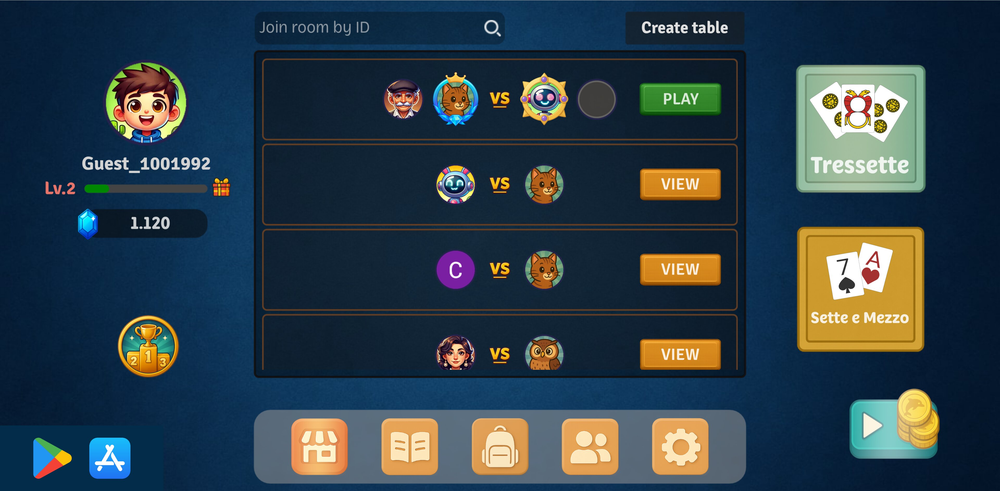

2. Playing

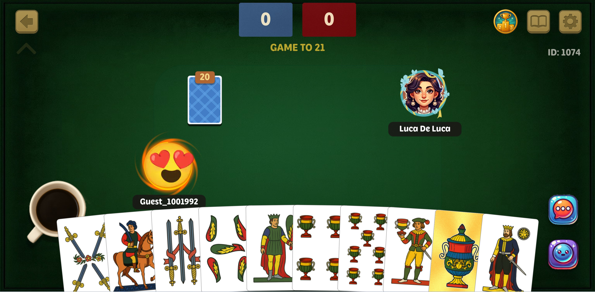

3. Spectating

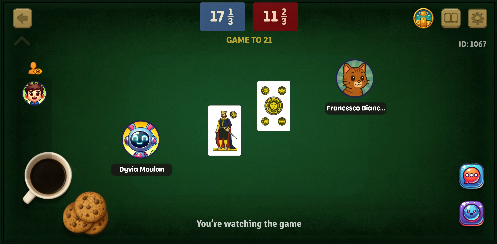

4. Inventory

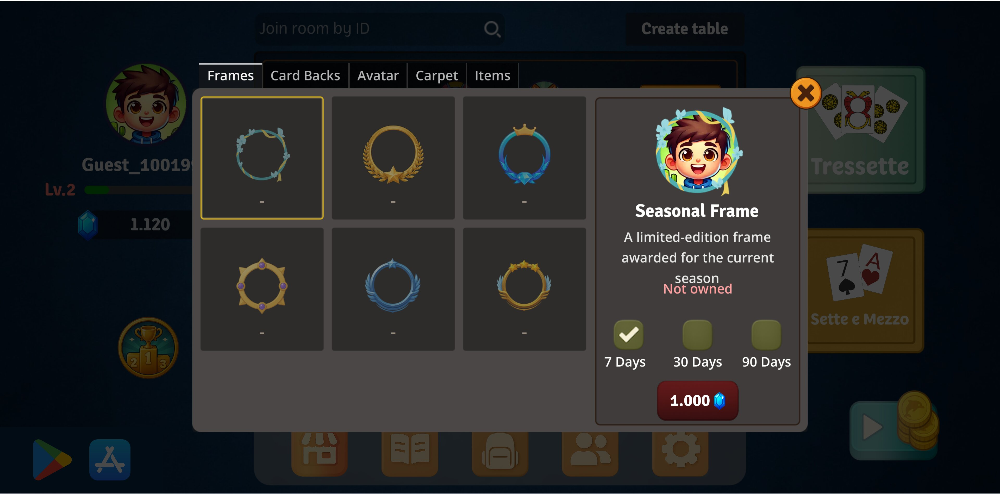

5. Ranking

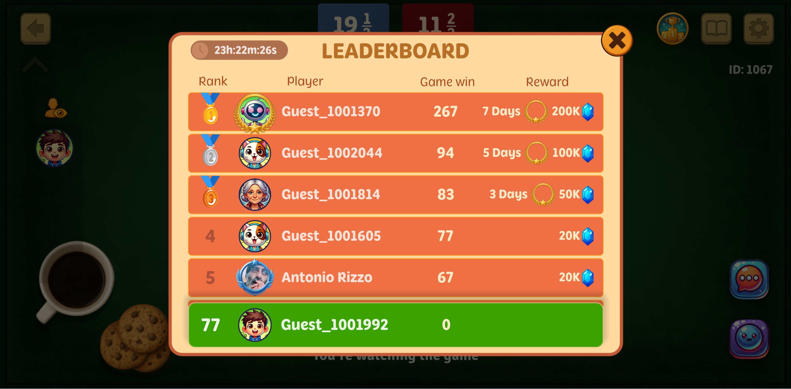

6. Shop

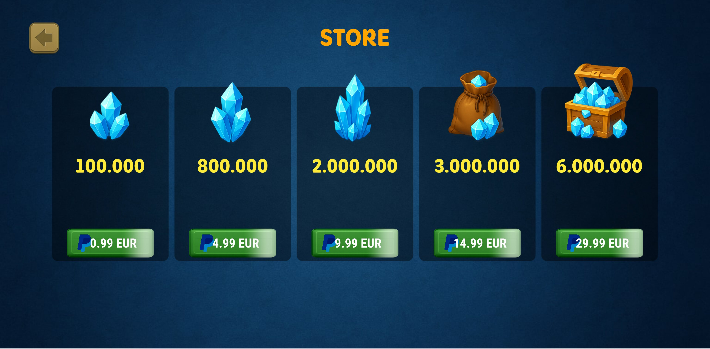

7. Info

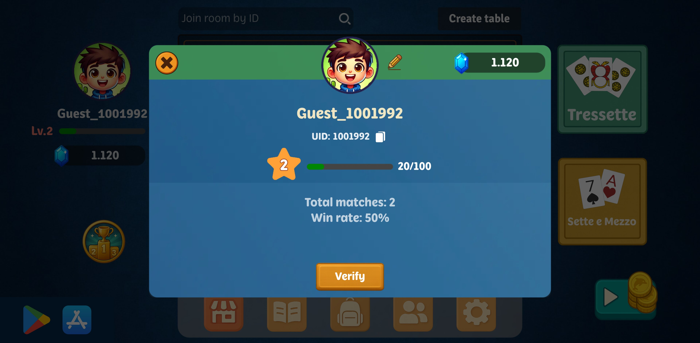

8. Friends

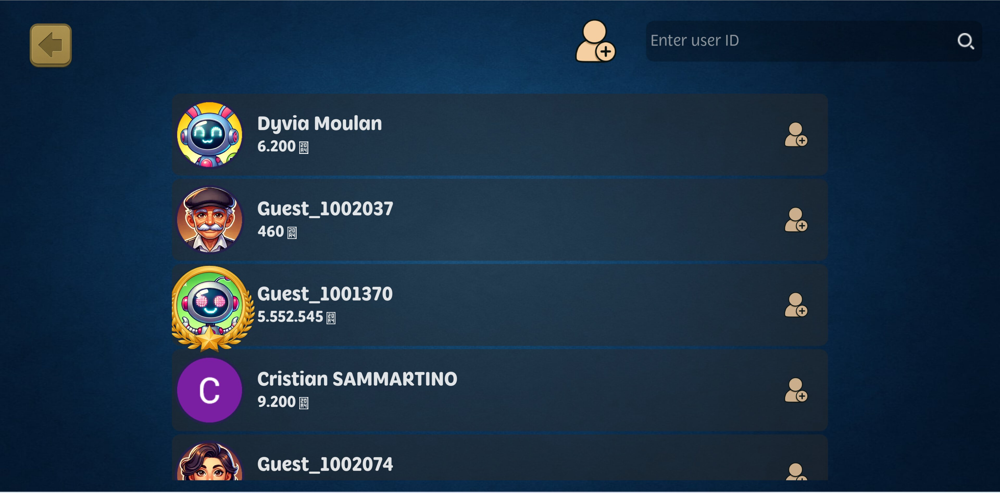

9. Chat

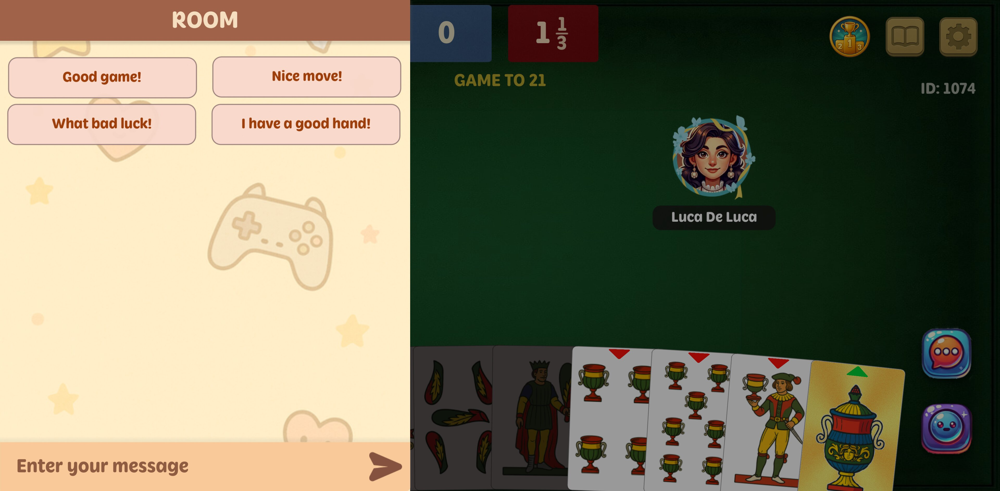

10. Interact

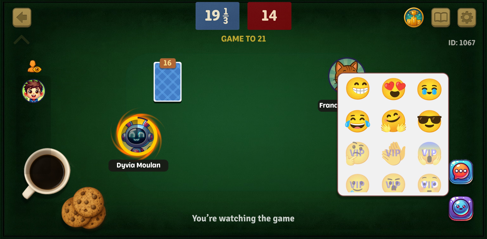

11. Level

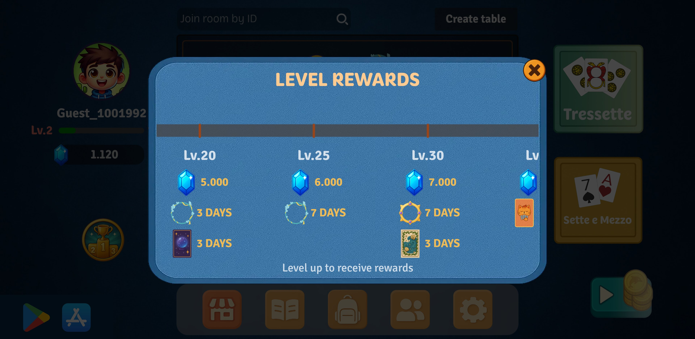