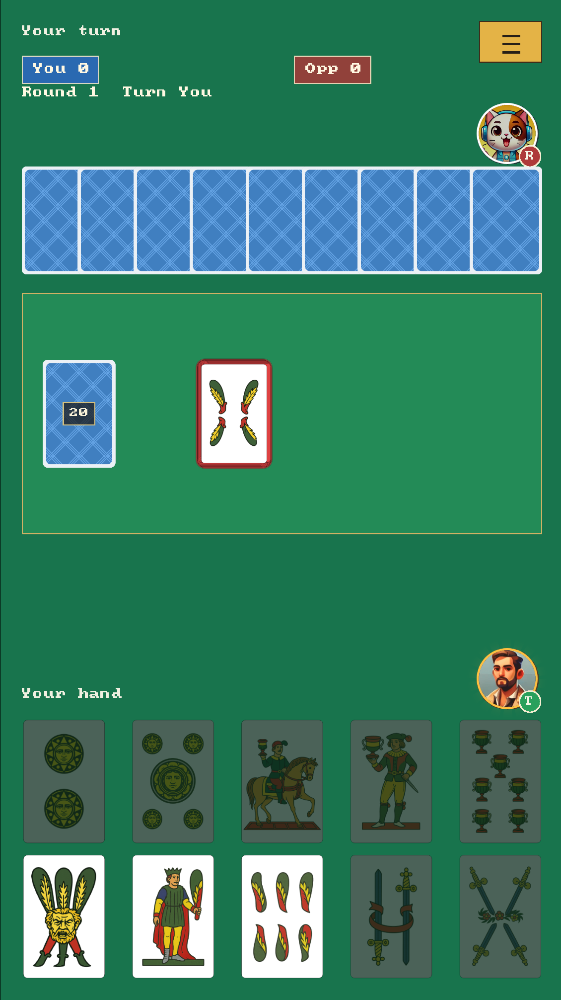

# Tressette Offline C++/SDL3

Offline prototype for a 2-player Tressette game in portrait mode, using C++20 and SDL3.



## Build

```powershell
cmake -S . -B build
cmake --build build --config Release
```

Run:

```powershell
.\build\Release\tressette_offline.exe
```

If using a single-config generator such as Ninja, the binary is usually located at:

```powershell
.\build\tressette_offline.exe
```

If `Release\tressette_offline.exe` is currently open, the Visual Studio linker will not be able to overwrite the file. Close the game window and build again, or run the Debug version:

```powershell
cmake --build build --config Debug
.\build\Debug\tressette_offline.exe
```

## Controls

* Click/touch a card in the bottom hand to play it.
* Press `N` or the `New Deal` button to deal again.
* Press `Esc` to quit.
* When a card is played, it flies from the hand to the table. After 2 cards are on the table, there is a short delay before comparing them and scoring the trick.

## Current Gameplay

* 2 players: the human player is at the bottom, the bot is at the top.
* Italian 40-card deck: Denari, Coppe, Spade, Bastoni.
* Each player is dealt 10 cards, and the remaining cards form the stock.
* The trick winner draws first, then the other player draws.
* Players must follow suit if possible.
* Scoring: A = 1, 3/2/Fante/Cavallo/Re = 1/3, other cards = 0; last trick +1.
* `card_id` follows the old server logic: `suit = card_id % 4`, `rank = card_id / 4 + 1`.
  For example, `0..3` are Aces in the 4 suits, `4..7` are 2s, and `8..11` are 3s.
* By default, the game uses `classic/{id}.png`; change `kCardStyle` in `src/main.cpp` to `"modern"` to use `modern/card_{id}.png`.
