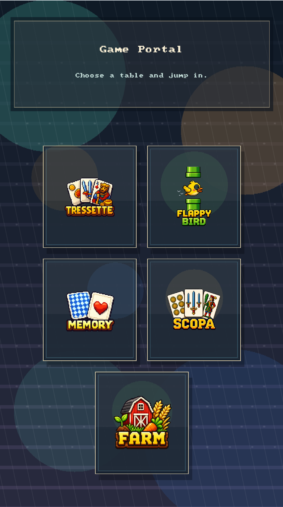
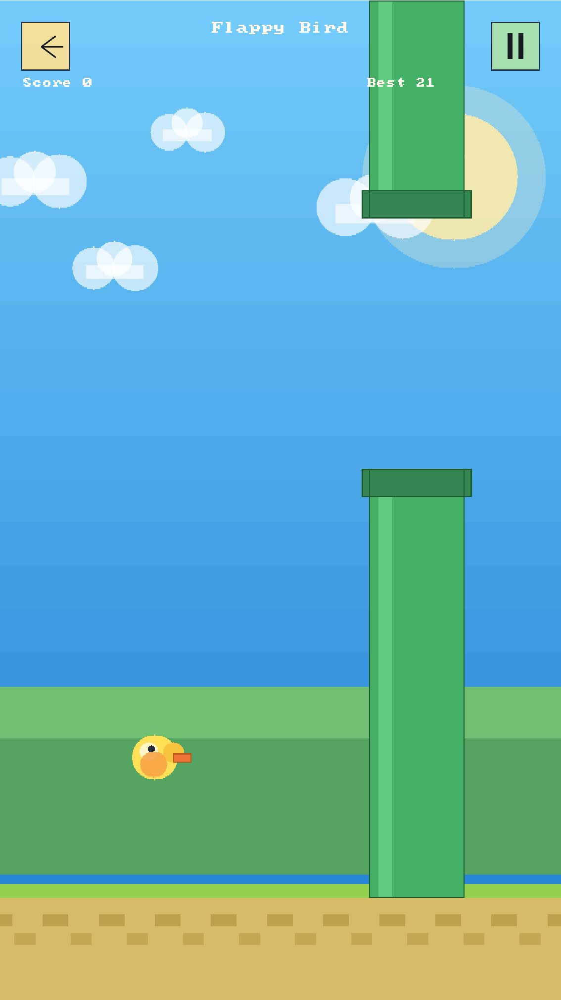

# Game Studio SDL3

Offline C++20/SDL3 portrait game collection with a lobby and several small games:
Tressette, Scopa, Memory Cards, Flappy Bird, and Tiny Golden Farm.

<p align="center">
  
  
  
</p>

## Desktop Build

```powershell
cmake -S . -B build
cmake --build build --config Release
```

Run:

```powershell
.\build\Release\tressette_offline.exe
```

If using a single-config generator such as Ninja, the binary is usually located at:

```powershell
.\build\tressette_offline.exe
```

If `Release\tressette_offline.exe` is currently open, the Visual Studio linker will not be able to overwrite the file. Close the game window and build again, or run the Debug version:

```powershell
cmake --build build --config Debug
.\build\Debug\tressette_offline.exe
```

## Android Build

The Android project lives in `android-project/`. Build it with the root CMake project so the real C++ sources are compiled instead of the SDL template source:

```powershell
cd android-project
.\gradlew.bat assembleDebug -PBUILD_WITH_CMAKE
```

The debug APK is generated at:

```powershell
android-project\app\build\outputs\apk\debug\app-debug.apk
```

`android-project/local.properties`, Gradle caches, native `.cxx` output, APKs, and app build folders are local machine/build artifacts and are ignored by git.

## Save Data

Flappy Bird high score uses SDL app-local storage via `SDL_GetPrefPath("GameStudio", "Tressette")`. If an old desktop save exists at `save/flappy_high_score.txt`, the game migrates the higher value into the app-local high score file.

Tiny Golden Farm currently stores its save in `farm_save.txt` from the working directory.

## Controls

* Use the lobby to select a game.
* Click/touch cards, buttons, plots, or tabs depending on the current game.
* Press `Esc` to quit the active desktop window.
* In Tressette, press `N` or use the menu to start a new deal.

## Tressette Gameplay

* 2 players: the human player is at the bottom, the bot is at the top.
* Italian 40-card deck: Denari, Coppe, Spade, Bastoni.
* Each player is dealt 10 cards, and the remaining cards form the stock.
* The trick winner draws first, then the other player draws.
* Players must follow suit if possible.
* Scoring: A = 1, 3/2/Fante/Cavallo/Re = 1/3, other cards = 0; last trick +1.
* `card_id` follows the old server logic: `suit = card_id % 4`, `rank = card_id / 4 + 1`.
  For example, `0..3` are Aces in the 4 suits, `4..7` are 2s, and `8..11` are 3s.
* By default, the game uses `classic/{id}.png`; change `kCardStyle` in `src/main.cpp` to `"modern"` to use `modern/card_{id}.png`.
