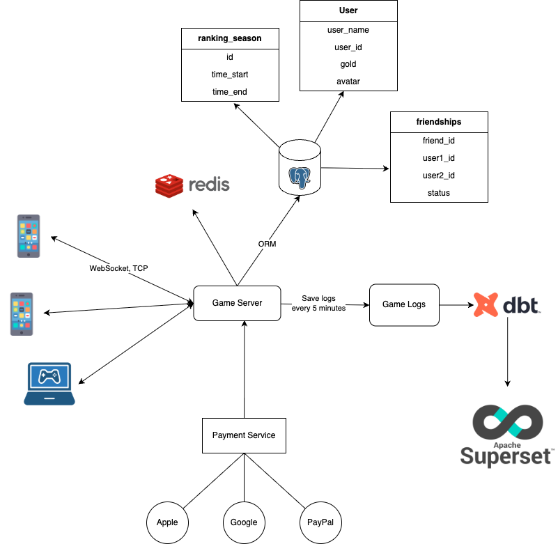
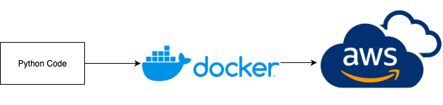
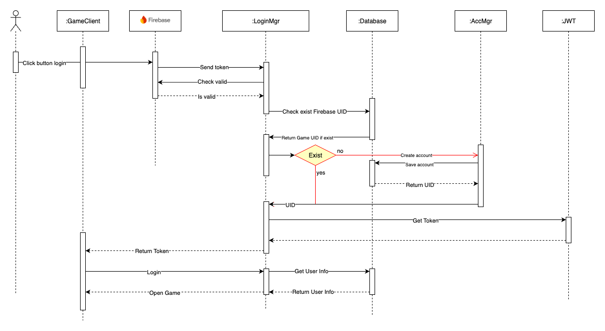
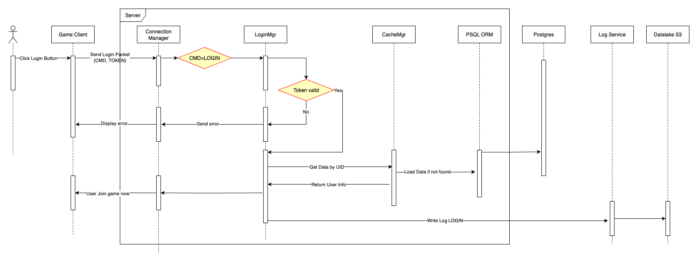
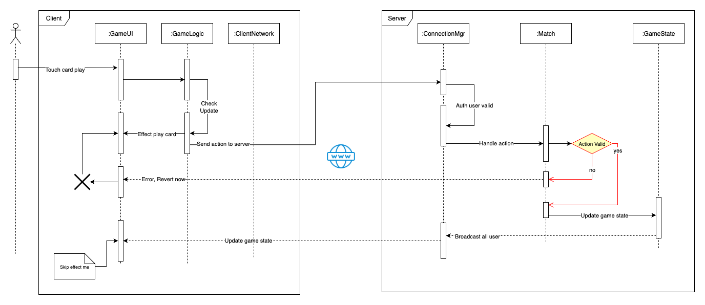
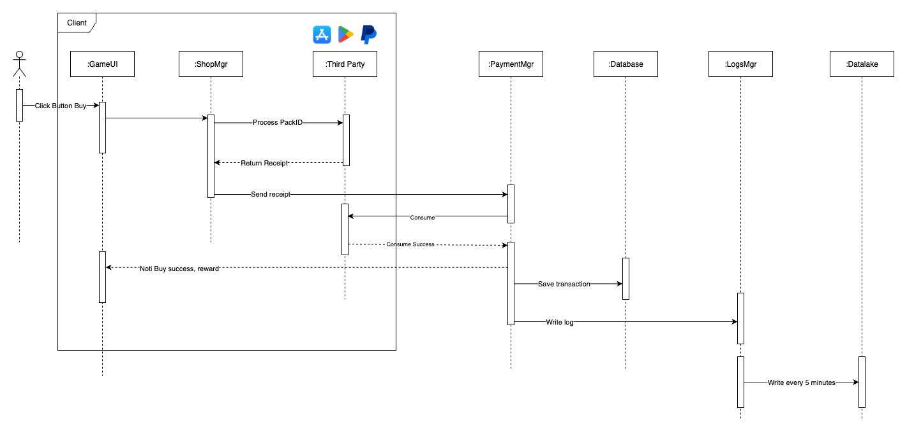
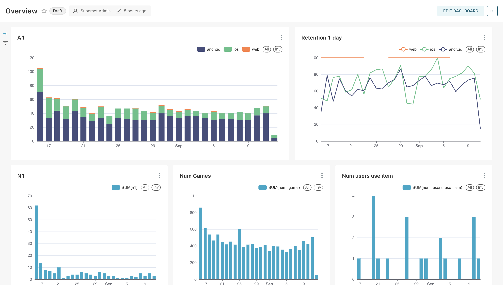

# Tressette Server - Python

This project was migrated from the old repository: https://github.com/FCBTruong/tressette_server

### 1. Overview

---
### 2. Flow build

---
### 3. Flow sequence

#### 1. Signup/login Firebase


#### 2. Login


#### 3. Play Card (In game)


#### 4. Payment


---

## 🚀 Setup Instructions

### 1. Set up Python environment
```bash
python3 -m venv env
source env/bin/activate
pip install -r requirements.txt
````

### 2. Start local services (macOS)

```bash
brew services start postgresql
brew services start redis
```

### 3. Generate gRPC code

```bash
python -m grpc_tools.protoc -I. --python_out=. src/base/network/packets/packet.proto
```

### 4. Run the server

```bash
uvicorn main:app --reload
```

## Dashboard



