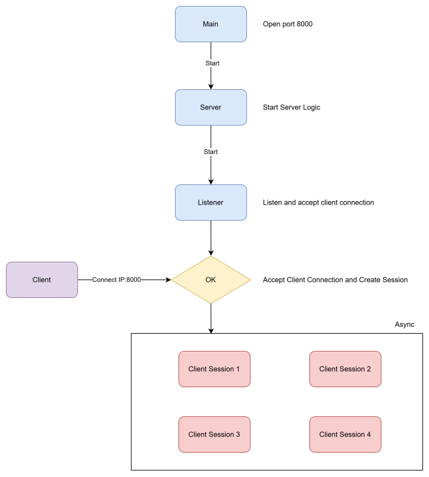
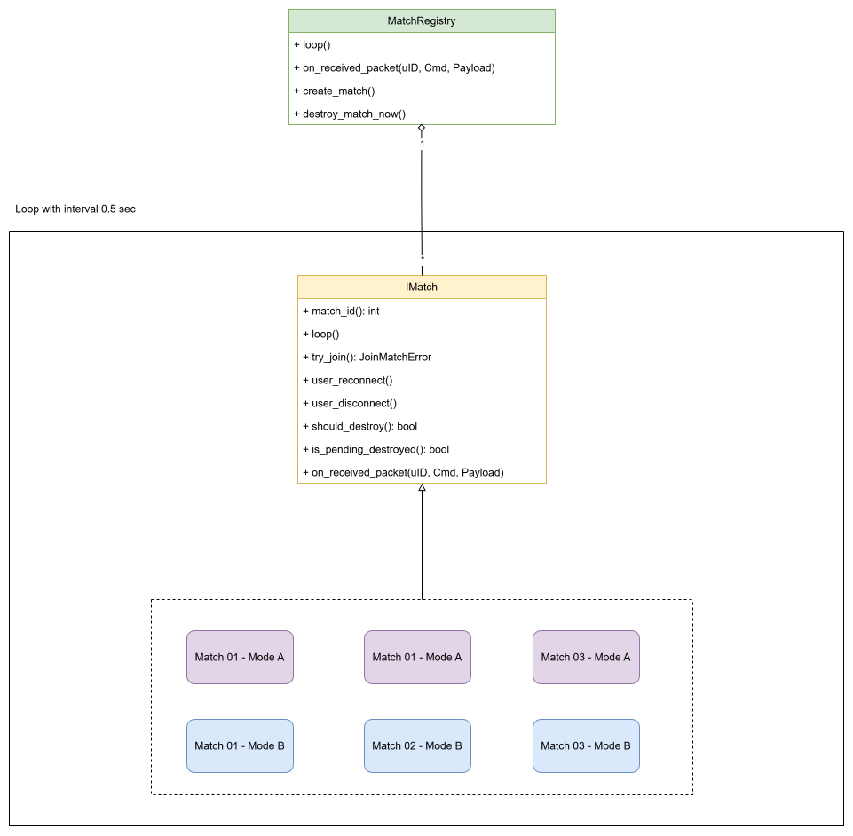

# Tressette Server - C++

This C++ server replaces the old Python server to improve performance and scalability.

The networking layer uses:

- **Boost.Asio** for asynchronous networking and low-level I/O
- **Boost.Beast** for WebSocket support
- **Protocol Buffers 3.20.3** for packet serialization
- **libpq / libpqxx** for PostgreSQL access

## Flow Overview



## Architecture

### Concurrency Model

The server currently uses asynchronous I/O on a single main `io_context` thread for networking and gameplay state.

Blocking jobs such as database work should not run on that thread. The project now includes a simple async DB handoff through `Server::execute_db_async(...)`, which runs SQL on a dedicated worker thread and posts the result back to the main `io_context`.

Current rule of thumb:

- The main Asio executor owns live game state, routing, timers, and match updates.
- Do not touch `MatchRegistry`, `GameManager`, or live session state from detached threads.
- Blocking work such as SQL should run on a worker thread and post results back to the main executor.
- Shared cross-thread containers should use a `mutex` where needed.

### Signal Bus

The signal bus is implemented in `src/core/signal_bus.hpp` and the first server events live in `src/core/app_events.hpp`.

Current event flow:

- `Router` publishes `PacketReceivedEvent` instead of calling managers directly.
- `Server` wires subscriptions at startup and fans packet events out to `MatchRegistry`, `UsersInfoMgr`, and `GameManager`.
- Login publishes `UserLoggedInEvent`.
- A delayed `UserLoginSettledEvent` is emitted for post-login match reconnect behavior.
- Session removal publishes `UserDisconnectedEvent`.

Design notes:

- Events are strongly typed structs, not string event names.
- `publish()` snapshots handlers before invoking them, so handlers do not run under the bus lock.
- The bus is meant for notification and decoupling, not for request/response APIs.

## Add Your Own Game Mode

This project is built for scalable game applications, so you can modify it and create your own game mode. Networking, session management, data serialization, and common user actions such as joining rooms, matchmaking, and leaving are already handled.



You can create your own match by inheriting from the `IMatch` class.
This class provides the following functions:

* User join
* On receive packet: handles packets requested from the client when the player is in a room
* User disconnected
* User reconnect
* Destroy match

It also provides a loop function that is called every 0.5 seconds, although you can customize it as needed. You can use the `Tressette` mode as an example.

`MatchRegistry` manages the lifecycle of a match, but it requires the match to report its state back to it.

When adding a new game mode, keep all match mutations on the main executor. If a game mode needs database or HTTP work, do that on a worker thread and return to the main executor before changing match state or sending gameplay events.

## Local Development

Follow the instructions below to set up local development. This project is exposed on port `8000`, so make sure that port is available.

This project is developed primarily on **Windows**, so Windows is the recommended environment.

### Requirements

- Visual Studio 2022 with C++ toolchain
- CMake
- Git
- vcpkg
- Boost.Beast / Boost.Asio
- Protocol Buffers 3.20.3
- PostgreSQL client libraries via vcpkg

### Install vcpkg

Clone and bootstrap vcpkg:

```bash
git clone https://github.com/microsoft/vcpkg C:\vcpkg
cd C:\vcpkg
bootstrap-vcpkg.bat
````

### Install Dependencies

```bash
& "C:\vcpkg\vcpkg.exe" install
```

### Environment

Before running the server, copy the example environment file and update it with your local values.

```bash
copy .env.example .env
```

### Build

Configure the project with the vcpkg toolchain:

```bash
cmake -S . -B build -DCMAKE_TOOLCHAIN_FILE=C:/vcpkg/scripts/buildsystems/vcpkg.cmake
cmake --build build --config Debug
```

### Run

1. Run the server:

```bash
.\build\Debug\tressette_server.exe
```

2. Run the test client:

```bash
.\build\Debug\test_client.exe
```

## Protocol Buffers Setup

Take a look at `proto/packet.proto`. This is where packet structures are defined.

If you want to define messages exchanged between the client and server, you need to update this file. It allows you to generate protocol code from `proto/packet.proto`.

This is the serialization method used for communication between the client and server. In this project, Protocol Buffers is used to generate packet formats. Packets are serialized and sent in binary form.

### Install protoc

```bash
git clone --branch v3.20.3 --depth 1 https://github.com/protocolbuffers/protobuf.git protobuf-3.20.3
```

### Generate Packet Code

Configure your `.proto` files and the destination output path, then run:

```bash
.\gen-protobuf.sh
```

### Rebuilding protobuf

If you need to rebuild the protobuf library, see:

`docs/build-protobuf-3.20.3.md`

## Deployment

You can deploy on both Windows and Linux, but Linux is recommended because it is more cost-effective and generally provides better performance.

You can build the project with Docker, as a Dockerfile is already provided, or you can use the Linux binary directly.

### Build the Binary on Linux

* Move the project to a Linux environment, for example a VM on Windows or a CI/CD pipeline.
* Go to the project directory:

```bash
cd ~/workspace/server_cpp
```

* Build the project:

```bash
cmake -S . -B build -DCMAKE_BUILD_TYPE=Release
cmake --build build --target tressette_server -j"$(nproc)"
```

### Test on Linux

```bash
cd ~/workspace/server_cpp/build
./tressette_server
```

After building successfully, you need a server instance, such as an AWS EC2 instance.

SSH into the server and upload your `build` output to it.

### Run as a systemd Service

Create a `systemd` service to make sure the server restarts automatically if it fails:

```bash
sudo tee /etc/systemd/system/tressette.service >/dev/null <<'EOF'
[Unit]
Description=Tressette C++ Server
After=network.target

[Service]
Type=simple
User=ubuntu
WorkingDirectory=/home/ubuntu/tressette
ExecStart=/home/ubuntu/tressette/tressette_server
Restart=always
RestartSec=3

[Install]
WantedBy=multi-user.target
EOF

sudo systemctl daemon-reload
sudo systemctl enable tressette
sudo systemctl start tressette
```

